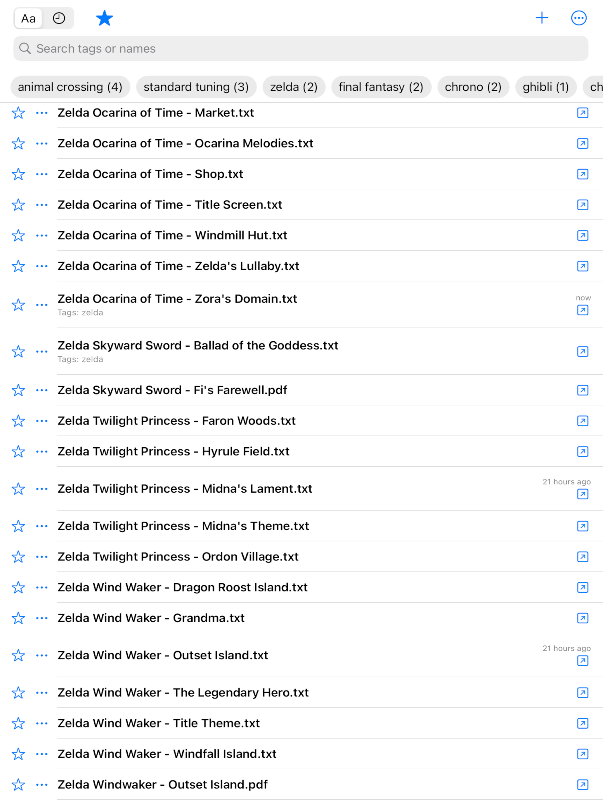

# TabBuddy

<div align="center">
  
</div>

A SwiftUI document viewer and organizer for iOS that helps you manage, tag, and read your text and PDF files with advanced auto-scrolling capabilities. Originally intended for easily reading and storing your personal guitar tabs. Published on the [iOS App Store](https://www.google.com/url?sa=t&source=web&rct=j&opi=89978449&url=https://apps.apple.com/ge/app/tab-buddy/id6742390560&ved=2ahUKEwj2msz6yqKRAxXPOEQIHWyQDW0QFnoECBsQAQ&usg=AOvVaw2RbC6g7kF9jWZ1Qoh4qqHs).

<div align="center">
  
  
</div>

## Features

### 📁 File Management
- **Import files and folders**: Support for both individual files and entire folder hierarchies
- **File browser**: Clean, organized view of all your imported documents
- **Bookmarks**: Secure file access using iOS security-scoped bookmarks
- **Favorites**: Mark frequently used files as favorites for quick access

### 🏷️ Smart Tagging System
- **Tag your files**: Organize documents with custom tags
- **Tag statistics**: See tag usage counts and filter by tags
- **Bulk tagging**: Apply tags to multiple files at once
- **Tag management**: Rename and reorganize tags with long-press gestures

### 📖 Advanced Reading Experience
- **Multi-format support**: View text files and PDFs seamlessly
- **Auto-scrolling**: Customizable auto-scroll with adjustable speed
- **Typography controls**: Adjustable font size with monospaced font support
- **Zoom and pan**: Smooth scaling and navigation
- **Reading progress**: Tracks last opened time and reading position

### 💾 Data Persistence
- **SwiftData integration**: Modern Core Data replacement for reliable storage
- **File metadata**: Stores import dates, scroll speeds, and user preferences
- **Undo support**: Full undo/redo functionality throughout the app

## Requirements

- iOS 17.0+
- Xcode 15.0+
- Swift 5.9+

## Installation

1. Clone this repository:
   ```bash
   git clone https://github.com/yourusername/tab-buddy.git
   ```

2. Open `TabBuddy.xcodeproj` in Xcode

3. Build and run the project on your iOS device or simulator

## Usage

### Importing Files
1. Tap the import button in the file browser
2. Choose between importing individual files or entire folders
3. Select your documents from the iOS file picker
4. Files will be imported and bookmarked for secure access

### Organizing with Tags
1. Long-press on any file to edit tags
2. Add custom tags to categorize your documents
3. Use the tag header to filter files by specific tags
4. Long-press on tag chips to rename or manage tags

### Reading Documents
1. Tap any file in the browser to open it
2. Use pinch gestures to zoom in/out
3. Tap the auto-scroll button to start/stop automatic scrolling
4. Adjust scroll speed with the slider
5. Change font size using the typography controls

## Architecture

TabBuddy is built using modern iOS development practices:

- **SwiftUI**: Declarative user interface framework
- **SwiftData**: Modern data persistence with `@Model` classes
- **Async/Await**: Swift concurrency for file operations
- **MVVM Pattern**: Clean separation of concerns
- **Security-Scoped Bookmarks**: Secure file access across app launches

### Key Components

- `ContentView`: Main app navigation and coordination
- `FileBrowserView`: File listing and organization interface
- `TabViewerView`: Document reading and interaction
- `FileItem`: SwiftData model for file metadata
- `TagIndexer`: Tag statistics and management system

## Contributing

Contributions are welcome! Please feel free to submit a Pull Request. For major changes, please open an issue first to discuss what you would like to change.

### Development Setup

1. Fork the repository
2. Create your feature branch (`git checkout -b feature/AmazingFeature`)
3. Commit your changes (`git commit -m 'Add some AmazingFeature'`)
4. Push to the branch (`git push origin feature/AmazingFeature`)
5. Open a Pull Request

## License

This project is licensed under the MIT License - see the [LICENSE](LICENSE) file for details.

## Acknowledgments

- Built with SwiftUI and SwiftData
- Uses iOS security-scoped bookmarks for file access
- Inspired by the need for a simple, powerful document organizer

## Support

If you encounter any issues or have questions, please file an issue on GitHub or reach out to the development team.

---

**Note**: This app requires file access permissions to import and view your documents. All file access is handled securely using iOS sandbox and security-scoped bookmarks.
