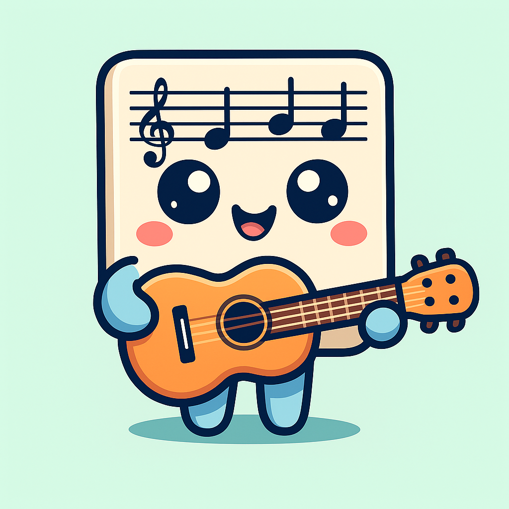
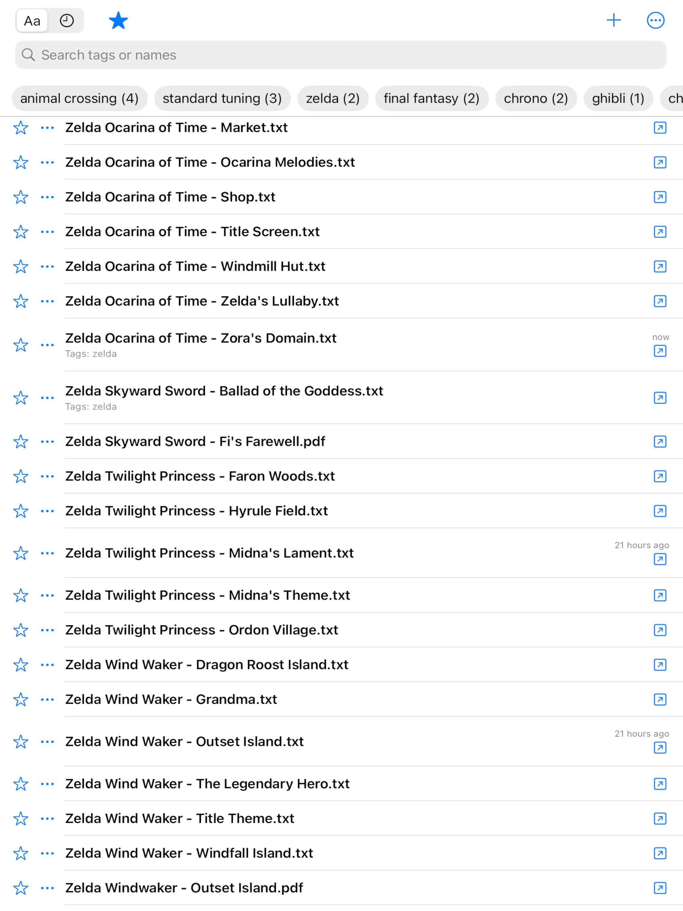
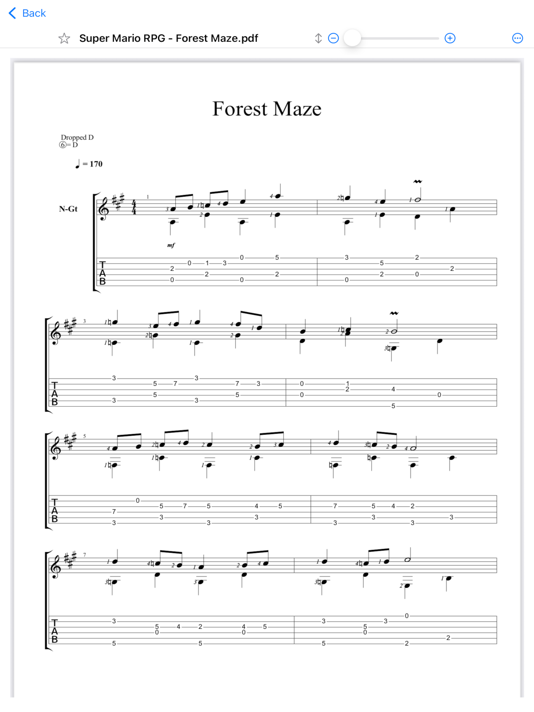

# TabBuddy

<div align="center">
  
</div>

A SwiftUI document viewer and organizer for iOS that helps you manage, tag, and read your text, PDF, and Guitar Pro scores with advanced auto-scrolling capabilities. Originally intended for easily reading and storing your personal guitar tabs. Published on the [iOS App Store](https://www.google.com/url?sa=t&source=web&rct=j&opi=89978449&url=https://apps.apple.com/ge/app/tab-buddy/id6742390560&ved=2ahUKEwj2msz6yqKRAxXPOEQIHWyQDW0QFnoECBsQAQ&usg=AOvVaw2RbC6g7kF9jWZ1Qoh4qqHs).

<div align="center">
  
  
</div>

See [PROJECT.md](PROJECT.md) for the current feature inventory, product intent, architecture, and known limitations.

## Features

### 📁 File Management
- **Import files and folders**: Support for both individual files and entire folder hierarchies
- **File browser**: Clean, organized view of all your imported documents
- **App-managed library**: Imports are copied into the app library; originals remain untouched
- **Storage choice**: iCloud sync when available, local storage without an iCloud account, and a custom folder under Advanced
- **Favorites**: Mark frequently used files as favorites for quick access

### 🏷️ Smart Tagging System
- **Tag your files**: Organize documents with custom tags
- **Tag statistics**: See tag usage counts and filter by tags
- **Bulk tagging**: Apply tags to multiple files at once
- **Tag management**: Rename and reorganize tags with long-press gestures

### 📖 Advanced Reading Experience
- **Multi-format support**: View text files, PDFs, and Guitar Pro 3–8 files (`.gp3`, `.gp4`, `.gp5`, `.gpx`, `.gp`)
- **Guitar Pro practice player**: Offline notation and audio, track selection/solo, metronome, practice speed, zoom, and saved bar-range loops
- **Auto-scrolling**: Customizable auto-scroll with adjustable speed
- **Typography controls**: Adjustable font size with monospaced font support
- **Zoom and pan**: Smooth scaling and navigation
- **Reading progress**: Tracks last opened time and reading position

### 🎓 Tutor and Practice
- **Tutor**: guitar and piano lessons in a recommended order you can skip through, with optional side branches, spaced-repetition reviews, ear and fretboard games, and a glossary
- **Practice a library song**: TabBuddy listens through the microphone, compares what you play with the score, and reviews accuracy and tempo
- **Offline and on device**: no account, network, or MIDI cable needed

### 💾 Data Persistence
- **SwiftData integration**: Modern Core Data replacement for reliable storage
- **File metadata**: Stores import dates, scroll speeds, and user preferences
- **Undo support**: Full undo/redo functionality throughout the app

## Requirements

- iOS 17.0+
- Xcode 15.0+
- Swift 5.9+

## Installation

1. Clone this repository:
   ```bash
   git clone https://github.com/yourusername/tab-buddy.git
   ```

2. Open `TabBuddy.xcodeproj` in Xcode

3. Build and run the project on your iOS device or simulator

## Usage

### Importing Files
1. Tap the import button in the file browser
2. Choose between importing individual files or entire folders
3. Select your documents from the iOS file picker
4. Files are copied into your Tab Buddy library; the source files remain unchanged

When importing a folder, **Finding files…** appears before the file count is known. Access/copy errors and folders with no supported scores show an explanation.

If you used the older development app, keep it installed: the new registered app has separate storage. Import your original folder into the new app, then export metadata from the old app and restore that backup in the new one after selecting/scanning the intended library folder.

### Library Storage

The **Settings** sheet also contains Generate Tab Data, metadata backup export/restore, and Remove All Files. Removal still requires confirmation.
On first launch, tap **Get Started** to create the app library. iCloud sync is selected when available; otherwise the library uses this device’s Documents folder. No folder picker is required.

Open **… → Settings → Library Storage** to change between iCloud Drive and local storage. The app copies and verifies songs before switching and keeps the previous copies. Under **Advanced**, choose **Use Existing Folder** to read the scores directly from the folder you select. Choose **Copy Library to New Folder** only when you want a new Tab Buddy Library subfolder containing copies of your current songs. If an existing iCloud library becomes unavailable, it stays selected and shows a retry message instead of silently creating an empty replacement.

**Sync library with iCloud** controls both song files and library metadata (tags, favorites, and recent activity). Turning it off keeps a local library and stops metadata sync on this device while preserving existing cloud data. The library screen briefly reloads as the database connection changes.

Opening the app uses your saved library without rescanning the folder. After changing files outside TabBuddy, choose **… → Settings → Rescan Library**. You can keep browsing and opening songs while it runs; progress and Cancel appear in a bottom overlay without moving the library, with found, checked, newly added, and existing file counts. A summary remains after the scan.

**Keep available offline** is a separate option for a synced library. It downloads additional local song copies while sync stays enabled. Downloads refresh after scans/imports and can be retried from Library Storage. Turning it off removes only those extra copies. Advanced custom folders use local metadata; their storage provider may sync files independently.

Signing uses `com.gamicarts.TabBuddy` and the `iCloud.com.gamicarts.TabBuddy.library` container. Simulator tests cover local fallback, metadata connection changes, migration, and offline copies through isolated storage roots; a signed build on two devices signed into the same iCloud account is needed to verify live synchronization.

### Finding Music and Choosing an Instrument
Open **Add (+) → Find music online** in the library. Choose an instrument and enter a song, composer, artist, or game. Tap a source to open its web search; with an empty query, the source homepage opens. Free and purchase sources show the file formats to look for. Download a supported file, then use **Import Downloaded Files** or share it to TabBuddy.

The library instrument filter lists only instruments present in the current library, including scores containing several instruments. Search, tags, and folder navigation do not narrow its choices. Open **Score details** from a card's context menu or the viewer's title menu to edit instruments, credits, arrangement, and source. Your edits take precedence over automatic detection. Embedded metadata and text-tab data can be prepared through **Settings → Prepare Library** in resumable batches when files are available locally. Rescanning an existing folder skips embedded content reads so file-provider downloads cannot block cataloguing. Files without clear instrument information can remain **Unspecified** until opened or edited. Score details saves descriptive metadata inside UTF-8 text, PDF, and GP3–5 library files, so it travels with the file. GPX/newer `.gp` edits currently remain library-only; personal practice history and tags still use library sync/backup.

### Original Notation
PDFs and text start in their original form; Guitar Pro starts with the notation stored in the file. Piano parts remain staff notation. Use the player settings to choose another supported display. For a PDF, **Create guitar arrangement** is an explicit, best-effort conversion that preserves the source.

Bass, ukulele, and extended-range guitar tabs retain their string counts. Smooth scrolling works for original scores; precise measure following requires parsed tabs or a supported structured score. General MusicXML and MuseScore import are not yet available.

### Tutor
Tap **Tutor** (graduation cap) in the library toolbar. Choose **Guitar** or **Piano** at the top of the sidebar (iPad) or home screen (iPhone). The tutor is written for an acoustic guitar or an acoustic/digital piano played into the device microphone.

- **Path**: stages 0–8 are a recommended order, not a gate. Tap any lesson to start it, or choose **Mark as done (skip)** in its detail to skip it (**Mark as not done** undoes this). **Continue** opens the first lesson you haven't finished. Side branches such as Rhythm reading, Fingerstyle basics, Blues shuffle, Reading the grand staff, and Pedal basics are optional detours suggested after a named lesson.
- **Lessons**: steps include reading with diagrams, listening demos, playing exercises the microphone checks, quizzes, and short song excerpts. Use ← / → to move between steps, Space to start or stop listening, and 1–4 to answer. Without microphone access, choose **Skip for now** on playing steps; quizzes still work.
- **Reviews**: finished lessons add review cards. **Reviews** shows what is due. Grade facts yourself (Again / Hard / Good / Easy); multiple-choice and play cards are graded for you.
- **Games**: Fretboard Hunt / Key Hunt, Chord Change Sprint, Interval Duel, Name That Quality, Rhythm Tapper, Scale Runner, and Note Rush. Each keeps a personal best; there are no streaks.
- **Songs you know**: library songs whose chord symbols use chords you have learned. Tap one to open it in the reader. Chords are read from converted scores and from text tabs already on the device; Guitar Pro chord names are not read yet.
- **Tutor settings**: instrument, a daily goal in minutes, and **Reset progress** for one instrument. Reset keeps calibration and your practice takes.

TabBuddy checks which pitches sound, not which string or fret you used. When it cannot tell, it shows a gray "not sure" and does not count it against you. All app sound stops while it listens, so follow the on-screen count-in and beat pulse.

### Calibrating the microphone
Open **Tutor → Calibration** before your first playing lesson, and again after changing headphones or an audio interface. Calibration is saved separately for each audio route.
1. Allow microphone access.
2. Check the input level. On iPad, stand it on a music stand within about 1 m of the guitar, with the top edge (where the microphones are) toward the sound hole. For piano, put it on the music desk with the top edge toward the strings or open lid. Keep the case and your hands off that edge, and turn off fans, music, or the TV.
3. Play the check note (open low E, or middle C) and confirm the detected note.
4. Run latency calibration: play along with 8 clicks, or use the silent visual pulses if you prefer no sound.

### Practicing a library song
Open a song and tap the **Practice** tool (waveform and microphone) in the bottom transport.
- **Available** for text tabs with readable tuning, PDFs after **Create guitar arrangement**, Guitar Pro files (the selected track), and any score with a MIDI file of the same name beside it. Otherwise the tool explains why it cannot listen.
- Set the **range** (defaults to your loop or the current system), **speed** (25–150%), and **instrument**.
- **Wait** mode waits on each note or chord until it hears it; → skips one. **Play-along** moves the cursor at your speed after a visual count-in. Space starts or stops a take; Escape leaves practice.
- During a take, heard notes turn green. Nothing turns red while you play.
- After the take, the **review** shows:
  - each expected note: hit, partial, wrong pitch with what you played, missed, or not sure
  - early/late timing
  - a **tempo ribbon** of your actual BPM per measure; tap a section to loop it
  - accuracy and weakest measures
  - playback of your recording
  - **suggestions** such as "loop measures 9–12 at 80%", which set the loop and speed in the reader
- If TabBuddy could not hear a take clearly, the review says so instead of scoring it. Leaving practice mid-take keeps takes longer than 3 seconds for review next time.
- **Past takes** lists earlier attempts with a per-measure accuracy history. Only the 10 newest takes per song keep audio.

Results come from on-device listening tuned on synthetic recordings. Accuracy with your instrument and room may vary, and "not sure" marks are expected.

### Privacy
Microphone audio is processed on the device and never uploaded. Practice recordings and tutor progress are kept in the app's local storage, not in iCloud or library backups. Deleting a take removes its recording.

### Organizing with Tags
1. Long-press on any file to edit tags
2. Add custom tags to categorize your documents
3. Use the tag header to filter files by specific tags
4. Long-press on tag chips to rename or manage tags

### Reading Documents
1. Tap any file in the browser to open it
2. Use pinch gestures to zoom in/out
3. Tap the auto-scroll button to start/stop automatic scrolling
4. Adjust scroll speed with the slider
5. Change font size using the typography controls

## Architecture

TabBuddy is built using modern iOS development practices:

- **SwiftUI**: Declarative user interface framework
- **SwiftData**: Modern data persistence with `@Model` classes
- **Async/Await**: Swift concurrency for file operations
- **MVVM Pattern**: Clean separation of concerns
- **Security-Scoped Bookmarks**: Secure file access across app launches

### Key Components

- `ContentView`: Main app navigation and coordination
- `FileBrowserView`: File listing and organization interface
- `TabViewerView`: Document reading and interaction
- `FileItem`: SwiftData model for file metadata
- `TagIndexer`: Tag statistics and management system

## Contributing

Contributions are welcome! Please feel free to submit a Pull Request. For major changes, please open an issue first to discuss what you would like to change.

### Development Setup

1. Fork the repository
2. Create your feature branch (`git checkout -b feature/AmazingFeature`)
3. Commit your changes (`git commit -m 'Add some AmazingFeature'`)
4. Push to the branch (`git push origin feature/AmazingFeature`)
5. Open a Pull Request

## License

This project is licensed under the MIT License - see the [LICENSE](LICENSE) file for details.

## Acknowledgments

- Built with SwiftUI and SwiftData
- Uses iOS security-scoped bookmarks for file access
- Inspired by the need for a simple, powerful document organizer

## Support

If you encounter any issues or have questions, please file an issue on GitHub or reach out to the development team.

---

**Note**: This app requires file access permissions to import and view your documents. All file access is handled securely using iOS sandbox and security-scoped bookmarks.

Imports save progress incrementally: the first song immediately, then batches of 100. Cancelling or encountering a later copy error keeps completed songs, including the last partial batch. If an older build copied songs without listing them, use Settings → Rescan Library to recover those catalog entries.

Import first copies/catalogs files without parsing. Use **Settings → Prepare Library** to prepare metadata and text tabs in batches of 100. Unfinished work resumes through **Settings → Prepare Library**, or on opening when **Prepare library automatically** is enabled (off by default); Pause is available in the status panel. It pauses when you leave the app and does not automatically download cloud-only scores or create guitar arrangements from PDFs.

For an external iCloud folder used as the library, Rescan Library indexes files in place without copying them. During enumeration, catalog entries are saved every 100 files; preparation is opt-in for locally available scores.

Starting a rescan while preparation is running pauses and finishes that preparation step first, then scans; unfinished preparation resumes only when automatic preparation is enabled. The bottom panel shows one active operation at a time.

In folder view, enter Select mode and tap folders to select their nested songs, or long-press a folder and choose **Remove Folder References** for an external library. This keeps iCloud source files intact. Managed-library removal deletes the selected score files.

Tiles hide unknown instruments and tunings. Tap a known instrument or tuning chip to edit Score details; use the tile’s Score details menu to add missing values. Tuning accepts presets or custom text and can be cleared. These are descriptive library fields, not changes to the score’s notes.

During external-folder rescans, **found** counts discovered paths while **saved to catalog** counts durable entries. Saved batches and their folders survive closing the app even before discovery completes. Run Rescan Library again to discover the remainder.

Preparation progress distinguishes prepared files, known cloud placeholders waiting for download, and read failures; failures show the latest filename and reason. Only the status panel observes progress, refreshed at most four times per second during preparation plus batch checkpoints; a dismissible summary retains unresolved results. Available file contents use coordinated content reads; cloud placeholders are checked before opening and remain pending. No bulk download is started by preparation.

Large-library responsiveness: scan and preparation counters are observed by their status subviews, not the library filter/sort view. Preparation fetches lightweight pending identifiers and processes at most 100 models at a time; text inference and conversion run on utility workers, with bounded catalog commits and time for UI work between batches. Discovery uses one path index and inserts new entries incrementally, without rebuilding the full catalog/tag index per discovery batch. Full reconciliation skips unchanged file-field writes. Folder mode is still catalog-backed; direct one-folder filesystem browsing is a proposed follow-up, not implemented.

Library sorting/search use a cached value index, with displayed-title sort keys prepared once per catalog snapshot. Filtering and sorting run on a cancellable worker; typing is debounced by 120 ms, while pickers start immediately. Catalog snapshots are refreshed in yielding chunks after saves or query membership changes, coalescing overlapping refresh requests. Returning from a score reuses the completed query. The grid renders 200 matches initially and adds more as the user scrolls; counts and Select All cover every match. Folder membership, instrument choices, and the recent rail reuse cached results. Startup no longer maintains a second filename-sorted library query or opens files to derive folder labels.

PDF opening displays file-access and coordinated-read errors with Retry instead of an empty viewer or a generic iCloud explanation. Known iCloud placeholders can reach the coordinated reader to download on demand; genuinely missing paths still fail. Opportunistic fingerprints are read on a utility worker and skip known cloud-only files.

Name sorting follows the visible score title, including embedded titles and user renames. Normalized tuning labels remain searchable. While the first index is loading, the library says Loading library rather than No scores. Returning to a cached filter invalidates any older pending search. Preparation guidance points external-folder users to Files for downloads. Text score parsing and derived-file writing run off the UI thread; PDFs cancel loading on exit and show read errors with Retry.

Player display menus omit the read-only Tuning & capo section; it offered no adjustment. Score details still supports descriptive tuning metadata, and score-defined tuning/capo continue to govern notation and playback.

Original/TabBuddy switching retains the reader surfaces for the currently open score, preserving scroll positions and avoiding repeated PDF loads or text-view creation. Switching pauses playback and scrolling, hides the inactive surface from touch/accessibility, and defers the preference save out of the gesture. Render models and canonical presentation are prepared off-main and reused; per-note layout uses one resolved string count/tuning per score. These caches last only for the open viewer session.

Opening, closing, and switching a score saves reading preferences after a short delay, including when you return to the library; leaving the app flushes pending saves. These actions avoid initializing audio or rebuilding the entire library index for practice-setting changes. Recents, play counts, and metadata searches continue to update.
